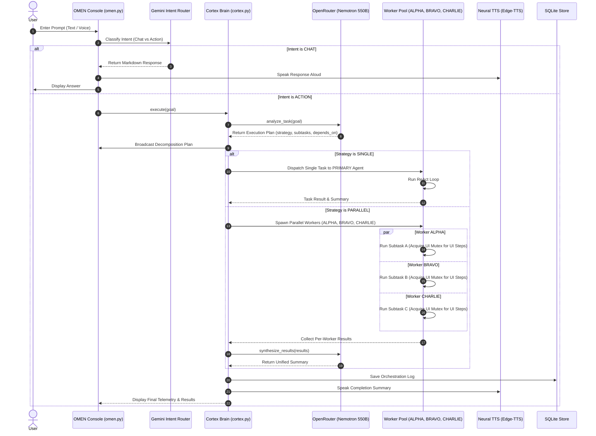
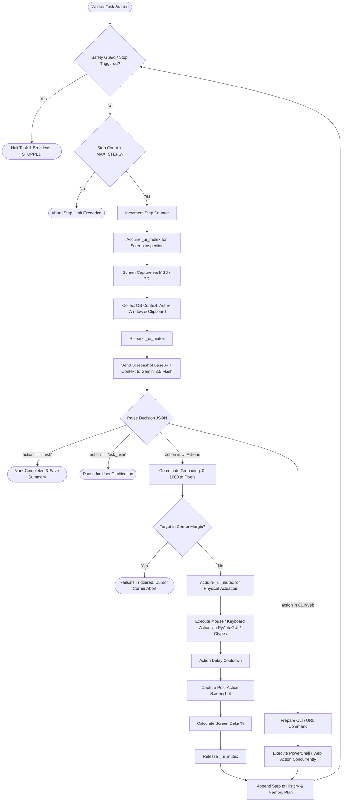
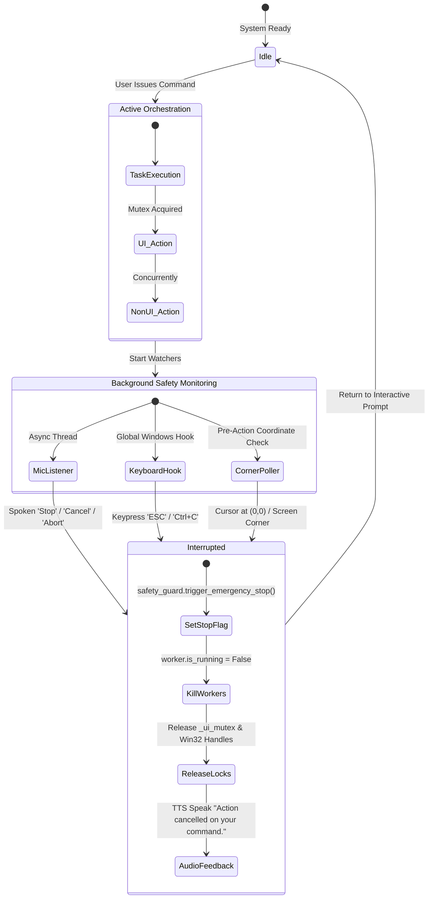

# ⚡ OMEN System Architecture & Technical Specification

> **OMEN (v3.0.0)** is an autonomous, multimodal personal AI companion and multi-agent desktop operating system engine built for Windows. It features hierarchical task orchestration, parallel agent execution, spatial visual grounding (0–1000 normalized coordinate space), native OS motor actuation, multi-tiered neural speech synthesis, voice activity detection (VAD), mid-flight voice interruption, and a zero-cost 11-model LLM cascade.

---

## 1. High-Level System Architecture

```mermaid
graph TB
    subgraph INGRESS["1. User Interaction & Ingress Layer"]
        CLI["OMEN TUI Console (omen.py)"]
        MIC["Microphone / VAD Engine (speech_recognition)"]
        SHORTCUT["Windows 1-Click Launchers (.bat / .lnk)"]
    end

    subgraph CORTEX_LAYER["2. Orchestration & Intelligence Layer (Cortex)"]
        CORTEX["Cortex Brain (backend/core/cortex.py)"]
        OR_PROVIDER["OpenRouter Provider (backend/llm/openrouter_provider.py)"]
        NEMOTRON["NVIDIA Nemotron 3 Ultra 550B (Primary Router)"]
        OR_FALLBACK["6-Tier OpenRouter Free Fallback Cascade"]
    end

    subgraph WORKER_LAYER["3. Multi-Agent Execution Pool"]
        W_ALPHA["Worker ALPHA (backend/core/worker.py)"]
        W_BRAVO["Worker BRAVO (backend/core/worker.py)"]
        W_CHARLIE["Worker CHARLIE (backend/core/worker.py)"]
        GEMINI_PROVIDER["Gemini Provider (backend/llm/gemini_provider.py)"]
        GEMINI_MODELS["5-Tier Gemini Multimodal Vision Cascade"]
    end

    subgraph MUTEX_SUB["Concurrency & Resource Lock"]
        UI_MUTEX["_ui_mutex (Asyncio Lock for Physical Screen / Mouse / Keyboard)"]
    end

    subgraph PERCEPTION["4. Perception & Visual Grounding"]
        SCAP["Screen Capturer (MSS / GDI)"]
        GROUNDER["Grounder (0-1000 Normalized Coordinate Mapper)"]
        VDIFF["Visual Diff Engine (PIL ImageChops / NumPy)"]
    end

    subgraph ACTUATION["5. OS Actuation & Motor Control"]
        INPUT["Input Controller (PyAutoGUI / Ctypes / Bezier Curves)"]
        WIN_MGR["Window Manager (Win32 user32 / dwmapi)"]
        SYS_TOOLS["System Tools (PowerShell / App Launcher / WMI)"]
        WEB_TOOLS["Web Tools (Default Browser / URL Dispatcher)"]
    end

    subgraph SAFETY_VOICE["6. Safety, Voice & Interruption"]
        SAFETY["Safety Guard (ESC / Corner Flick Killswitch)"]
        VOICE_INT["Voice Interrupter (Background Mic Watcher)"]
        TTS["Neural TTS (Edge-TTS + Pygame Mixer)"]
    end

    subgraph MEMORY["7. Episodic Memory & Storage"]
        SQLITE["SQLite Store (data/aether_memory.db)"]
        TBL_TASKS["task_history table"]
        TBL_ORCH["orchestration_log table"]
        TBL_PREF["user_preferences table"]
    end

    CLI -->|User Prompt| CORTEX
    MIC -->|Transcribed Audio| CLI
    SHORTCUT -->|Bootstrap| CLI

    CORTEX -->|Decompose & Classify| OR_PROVIDER
    OR_PROVIDER --> NEMOTRON
    NEMOTRON -.->|Fallback on 429/503| OR_FALLBACK

    CORTEX -->|Spawn Workers (Max 3)| W_ALPHA
    CORTEX -->|Spawn Workers (Max 3)| W_BRAVO
    CORTEX -->|Spawn Workers (Max 3)| W_CHARLIE

    W_ALPHA --> GEMINI_PROVIDER
    W_BRAVO --> GEMINI_PROVIDER
    W_CHARLIE --> GEMINI_PROVIDER
    GEMINI_PROVIDER --> GEMINI_MODELS

    W_ALPHA & W_BRAVO & W_CHARLIE --> UI_MUTEX
    UI_MUTEX --> SCAP
    UI_MUTEX --> INPUT
    UI_MUTEX --> WIN_MGR

    W_ALPHA & W_BRAVO & W_CHARLIE --> SYS_TOOLS
    W_ALPHA & W_BRAVO & W_CHARLIE --> WEB_TOOLS

    SCAP --> GROUNDER --> VDIFF
    INPUT & SYS_TOOLS & WIN_MGR & WEB_TOOLS -->|OS Feedback| W_ALPHA & W_BRAVO & W_CHARLIE

    VOICE_INT -->|Voice Keyword 'Stop'| SAFETY
    SAFETY -->|Abort Signal| CORTEX & W_ALPHA & W_BRAVO & W_CHARLIE
    CORTEX -->|Speech Audio| TTS
    CORTEX -->|Log Results| SQLITE
```

---

## 2. Component Breakdown & Layer Specifications

### 2.1 User Ingress & TUI Console
- **[`omen.py`](file:///d:/CODES/New%20folder/omen.py)**: Terminal User Interface (TUI) with ANSI cyberpunk styling. Provides a single interactive prompt (`OMEN ❯ `), real-time telemetry (display resolution, CPU/RAM utilization, voice status, active foreground window), and command routing.
- **[`omen.bat`](file:///d:/CODES/New%20folder/omen.bat)** / **[`omen_handsfree.bat`](file:///d:/CODES/New%20folder/omen_handsfree.bat)**: One-click Windows launch scripts activating the isolated virtual environment on drive `D:` (`d:\CODES\New folder\.venv`) without touching the Windows system Python or `C:` drive.
- **Microphone VAD (`speech_recognition`)**: Configured with dynamic energy thresholds and 1.2s silence detection for hands-free speech processing.

### 2.2 Orchestration & Intelligence Layer (Cortex)
- **[`backend/core/cortex.py`](file:///d:/CODES/New%20folder/backend/core/cortex.py)**: The central multi-agent dispatcher (`Cortex`).
  - Evaluates user requests for task complexity, subtask dependencies, and execution mode (`chat`, `single`, or `parallel`).
  - Constructs a dependency graph (`depends_on`) and manages the lifecycle of worker agents.
  - Limits parallel execution to `config.MAX_PARALLEL_AGENTS` (capped at 3).
  - Synthesizes per-agent outputs into a coherent final summary.
- **[`backend/llm/openrouter_provider.py`](file:///d:/CODES/New%20folder/backend/llm/openrouter_provider.py)**: Dedicated interface to OpenRouter utilizing a 7-model zero-cost fallback cascade:
  1. `nvidia/nemotron-3-ultra-550b-a55b:free` (550-Billion parameter reasoning model — primary)
  2. `nvidia/nemotron-3.5-lightning:free`
  3. `nvidia/nemotron-3-super-120b-a12b:free`
  4. `google/gemma-4-31b-it:free`
  5. `nvidia/nemotron-3-nano-30b-a3b:free`
  6. `google/gemma-4-26b-a4b-it:free`
  7. `openai/gpt-oss-20b:free`

### 2.3 Worker Execution Pool (Autonomous ReAct Engine)
- **[`backend/core/worker.py`](file:///d:/CODES/New%20folder/backend/core/worker.py)**: Lightweight autonomous worker agents (`ALPHA`, `BRAVO`, `CHARLIE`).
  - Executes a ReAct (Reason + Act) loop: Sense (Screenshot) ➜ Reason (Gemini Multimodal) ➜ Actuate (Mouse/Keyboard/CLI) ➜ Verify (Visual Diff).
  - Employs an `asyncio.Lock()` (`_ui_mutex`) ensuring thread-safe access to physical mouse/keyboard resources while allowing non-UI tasks (PowerShell, file operations, web queries) to execute in parallel.
- **[`backend/core/agent.py`](file:///d:/CODES/New%20folder/backend/core/agent.py)**: Primary single-agent execution pipeline (`AetherAgent`), maintained for direct single-goal execution.
- **[`backend/llm/gemini_provider.py`](file:///d:/CODES/New%20folder/backend/llm/gemini_provider.py)**: Multimodal reasoning engine utilizing Google's Gemini API with a 5-tier fallback cascade:
  1. `gemini-3.5-flash` (Primary fast vision & grounding)
  2. `gemini-3.7-flash` (Complex multimodal fallback)
  3. `gemini-flash-latest`
  4. `gemini-3-flash-preview`
  5. `gemini-2.5-computer-use-preview-10-2025`

### 2.4 Perception & Spatial Visual Grounding
- **[`backend/vision/screen_capture.py`](file:///d:/CODES/New%20folder/backend/vision/screen_capture.py)**: High-speed screen grabber utilizing `mss` and Windows GDI `ImageGrab` fallback. Encodes full-resolution desktop frames to JPEG base64 (scaled to max dimension 1280px).
- **[`backend/vision/grounder.py`](file:///d:/CODES/New%20folder/backend/vision/grounder.py)**: Translates normalized `[0, 1000]` coordinates emitted by LLMs into absolute screen pixel coordinates:
  $$\text{pixel\_x} = \text{round}\left(\frac{\text{norm\_x}}{1000} \times \text{screen\_width}\right)$$
  $$\text{pixel\_y} = \text{round}\left(\frac{\text{norm\_y}}{1000} \times \text{screen\_height}\right)$$
  Also renders visual action overlays (bounding boxes, click targets) for debugging and visual tickers.
- **[`backend/vision/visual_diff.py`](file:///d:/CODES/New%20folder/backend/vision/visual_diff.py)**: Calculates post-action visual delta percentage ($\Delta\%$) between pre-action and post-action screenshots using `PIL.ImageChops.difference()` and grayscale pixel histograms to verify UI state mutations.

### 2.5 OS Actuation & Motor Control
- **[`backend/actions/input_controller.py`](file:///d:/CODES/New%20folder/backend/actions/input_controller.py)**: Native mouse and keyboard driver. Implements natural Bezier curve cursor trajectories (`pyautogui` with ease-out timing), single/double/right clicks, key presses, hotkeys (`Win+R`, `Ctrl+C`), mouse wheel scrolling, and drag-and-drop.
- **[`backend/actions/window_manager.py`](file:///d:/CODES/New%20folder/backend/actions/window_manager.py)**: Direct Windows API integration via `ctypes.windll.user32` and `dwmapi.dll` for window enumeration, foreground window detection, window activation (`SetForegroundWindow`), and window geometry inspection.
- **[`backend/actions/system_tools.py`](file:///d:/CODES/New%20folder/backend/actions/system_tools.py)**: Subprocess execution engine for PowerShell scripts, application launching via registry / PATH discovery, clipboard read/write via `win32clipboard`, and system telemetry (CPU, RAM, disk) via `psutil`.
- **[`backend/actions/web_tools.py`](file:///d:/CODES/New%20folder/backend/actions/web_tools.py)**: Web navigation and URL dispatcher via `webbrowser` and `httpx`.

### 2.6 Safety & Interruption Engine
- **[`backend/core/safety.py`](file:///d:/CODES/New%20folder/backend/core/safety.py)**: Real-time hardware killswitch listener using `pynput.keyboard`. Detects emergency `ESC` keypresses, manual `Ctrl+C`, and cursor corner flicking (moving mouse within 4 pixels of any screen corner) to instantly abort all running agents.
- **[`backend/voice/interrupter.py`](file:///d:/CODES/New%20folder/backend/voice/interrupter.py)**: Asynchronous background microphone watcher using non-blocking audio streams. Continuously listens for voice killwords (`stop`, `cancel`, `abort`, `halt`, `don't`, `wait`, `nevermind`) and fires emergency abort signals mid-flight.

### 2.7 Voice & Audio Pipeline
- **[`backend/voice/tts.py`](file:///d:/CODES/New%20folder/backend/voice/tts.py)**: Free neural text-to-speech using Microsoft Edge Neural TTS (`en-US-ChristopherNeural` / `en-US-AriaNeural`).
- **In-Memory Audio Mixer (`pygame.mixer`)**: Directly streams synthesized MP3 byte streams in memory via `io.BytesIO` to system audio devices without writing temporary files to disk.

### 2.8 Memory & Persistence
- **[`backend/core/memory.py`](file:///d:/CODES/New%20folder/backend/core/memory.py)**: Embedded SQLite database (`data/aether_memory.db`) storing:
  - `task_history`: Task IDs, goals, step sequences, status, and summaries.
  - `orchestration_log`: Multi-agent session IDs, decomposition strategies, subtask definitions, and worker results.
  - `user_preferences`: Key-value user configuration store.
  - `recipes`: Reusable multi-step macro routines.

---

## 3. Detailed Execution Flowcharts

### 3.1 User Request Lifecycle & Multi-Agent Routing



---

### 3.2 Autonomous ReAct Vision Loop & Actuation



---

### 3.3 Concurrent Voice Interruption & Emergency Killswitch Flow



---

## 4. Multi-LLM Provider & Model Topology

OMEN incorporates an 11-model dual-provider architecture operating completely on zero-cost tiers:

| Provider | Model ID | Primary Role | Context Window | Specialization |
| :--- | :--- | :--- | :--- | :--- |
| **OpenRouter** | `nvidia/nemotron-3-ultra-550b-a55b:free` | **Cortex Primary** | 1,000,000 | 550B Parameter Task Decomposition & Planning |
| **OpenRouter** | `nvidia/nemotron-3.5-lightning:free` | Cortex Fallback 1 | 1,000,000 | Fast Agentic Workflow Reasoning |
| **OpenRouter** | `nvidia/nemotron-3-super-120b-a12b:free` | Cortex Fallback 2 | 262,144 | Deep Reasoning & Complex Decomposition |
| **OpenRouter** | `google/gemma-4-31b-it:free` | Cortex Fallback 3 | 262,144 | Dense Instruction Following |
| **OpenRouter** | `nvidia/nemotron-3-nano-30b-a3b:free` | Cortex Fallback 4 | 256,000 | Low-Latency Task Splitting |
| **OpenRouter** | `google/gemma-4-26b-a4b-it:free` | Cortex Fallback 5 | 262,144 | Backup Text Reasoning |
| **OpenRouter** | `openai/gpt-oss-20b:free` | Cortex Fallback 6 | 131,072 | General Instruction Following |
| **Google Gemini** | `gemini-3.5-flash` | **Worker Primary** | 1,000,000 | Real-Time Multimodal Screen Vision & Spatial Grounding |
| **Google Gemini** | `gemini-3.7-flash` | Worker Fallback 1 | 1,000,000 | High-Complexity Multimodal Reasoning |
| **Google Gemini** | `gemini-flash-latest` | Worker Fallback 2 | 1,000,000 | Stable Flash Tier |
| **Google Gemini** | `gemini-3-flash-preview` | Worker Fallback 3 | 1,000,000 | High-Throughput Preview |
| **Google Gemini** | `gemini-2.5-computer-use-preview-10-2025` | Worker Fallback 4 | 1,000,000 | Specialized Coordinate & UI Grounding |

---

## 5. Concurrency, Mutex Locking & Desktop Safety Model

Because Windows desktop UI environments feature a single active mouse pointer and single keyboard focus point, running parallel agents on a desktop presents physical contention challenges. OMEN solves this using **Interleaved Parallel Mutex Control**:

1. **Non-UI Concurrency**: Worker agents running CLI commands (PowerShell, file creation, data processing) or background web requests run truly concurrently via `asyncio.gather()`.
2. **UI Action Mutex (`_ui_mutex`)**: When an agent needs to capture the screen, click, drag, or type, it acquires the asynchronous `_ui_mutex`. Other agents wait in queue until the UI action and post-action visual verification complete, preventing conflicting clicks or clobbered input streams.
3. **Corner Failsafe**: Before any cursor movement, target coordinates are checked against screen boundaries ($\text{margin} = 4\text{px}$). If the target or physical mouse enters a corner, execution aborts immediately.
4. **Non-Blocking Voice Watcher**: The voice interruption thread runs independently of the `asyncio` event loop on a daemon thread, ensuring voice commands are never blocked by heavy CPU or UI operations.

---

## 6. Project Directory & Source Traceability Matrix

```
d:\CODES\New folder\
├── .env                                  # Environment variables (API keys, models, voice)
├── .venv\                                # Isolated Python 3.13 virtual environment on D: drive
├── omen.py                               # Master TUI Interactive Console & Terminal App
├── omen.bat                              # 1-Click Desktop launcher
├── omen_handsfree.bat                    # 1-Click Hands-Free Voice launcher
├── requirements.txt                      # Project dependency specification
├── data\
│   └── aether_memory.db                  # SQLite episodic memory store
└── backend\
    ├── config.py                         # Application settings and Pydantic configuration
    ├── actions\
    │   ├── input_controller.py           # Mouse (Bezier), keyboard, and hotkey driver
    │   ├── system_tools.py               # PowerShell, app launcher, and system metrics
    │   ├── window_manager.py             # Win32 user32/dwmapi window control
    │   └── web_tools.py                  # Browser navigation and web fetch
    ├── core\
    │   ├── cortex.py                     # Cortex Distributor/Analyzer orchestrator
    │   ├── worker.py                     # Parallel worker agents with UI mutex
    │   ├── agent.py                      # Single-agent autonomous ReAct controller
    │   ├── safety.py                     # Hardware killswitch and corner failsafe
    │   ├── memory.py                     # SQLite persistence engine
    │   └── planner.py                    # Multi-step task plan data structure
    ├── llm\
    │   ├── base.py                       # Abstract BaseLLMProvider interface
    │   ├── openrouter_provider.py        # OpenRouter 7-model fallback provider
    │   ├── gemini_provider.py            # Google Gemini 5-model multimodal provider
    │   ├── ollama_provider.py            # Local offline vision provider
    │   └── openai_compat.py              # Generic OpenAI-compatible client
    ├── vision\
    │   ├── screen_capture.py             # High-speed MSS/GDI desktop screen capture
    │   ├── grounder.py                   # 0-1000 coordinate normalizer and annotator
    │   └── visual_diff.py                # Visual difference and screen delta calculator
    └── voice\
        ├── interrupter.py                # Background continuous voice cancellation engine
        └── tts.py                        # Microsoft Edge neural speech synthesizer
```
