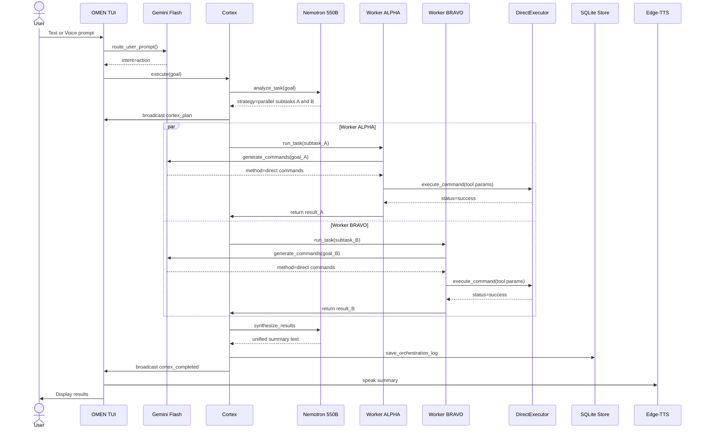
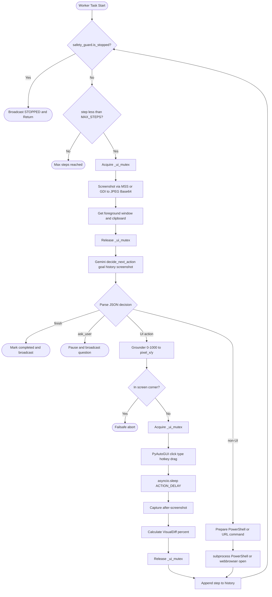
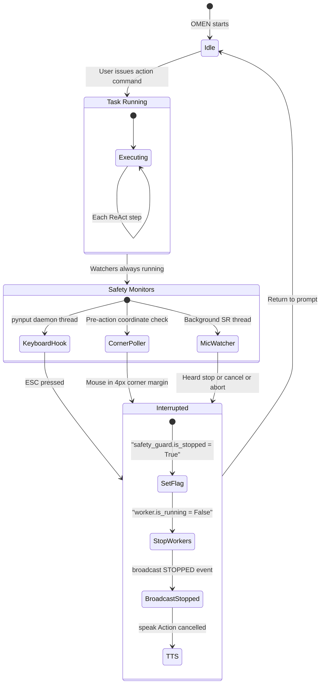

# ⚡ OMEN — Complete System Architecture Document

> **OMEN v3.0.0** is a terminal-first, zero-cost, multimodal autonomous AI system for Windows.
> It combines a 550B-parameter orchestration brain, a pool of multimodal vision-action workers,
> real-time screen perception, native OS motor control, Android phone control, continuous voice I/O,
> and an embedded episodic memory engine — all operating on free-tier APIs at **$0.00 cost**.

---

## Table of Contents

1. [Big Picture Overview](#1-big-picture-overview)
2. [Layered Architecture](#2-layered-architecture)
3. [Layer 1 — User Ingress and TUI Console](#3-layer-1)
4. [Layer 2 — Intent Router Fast-Path](#4-layer-2)
5. [Layer 3 — Cortex Orchestration Brain](#5-layer-3)
6. [Layer 4 — Execution Engine Direct vs Vision](#6-layer-4)
7. [Layer 5 — Worker Agents ReAct Vision Loop](#7-layer-5)
8. [Layer 6 — Phone Worker Android Mobile Agent](#8-layer-6)
9. [Layer 7 — Perception and Visual Grounding](#9-layer-7)
10. [Layer 8 — OS Actuation and Motor Control](#10-layer-8)
11. [Layer 9 — Safety and Interruption System](#11-layer-9)
12. [Layer 10 — Voice Pipeline](#12-layer-10)
13. [Layer 11 — LLM Provider Topology](#13-layer-11)
14. [Layer 12 — Episodic Memory and Persistence](#14-layer-12)
15. [Concurrency Model and Mutex Architecture](#15-concurrency)
16. [Full Request Lifecycle Walkthrough](#16-lifecycle)
17. [Data Flow Diagrams](#17-diagrams)
18. [Configuration Reference](#18-config)
19. [Dependency Map](#19-deps)
20. [Project File Tree](#20-tree)

---

## 1. Big Picture Overview

OMEN is a **multi-agent autonomous system** organized around a clear separation of responsibilities:

| Role | Module | Technology |
|------|--------|------------|
| **Orchestrator Brain** | `Cortex` | NVIDIA Nemotron 550B via OpenRouter |
| **Vision-Action Workers** | `WorkerAgent` / `AetherAgent` | Google Gemini Flash (Multimodal) |
| **Phone Agent** | `PhoneWorker` | ADB + Gemini Vision |
| **Direct Executor** | `DirectExecutor` / `PhoneExecutor` | Python subprocess / ADB intents |
| **Screen Perception** | `ScreenCapturer` + `Grounder` | MSS, GDI, PIL, 0-1000 norm space |
| **OS Motor Control** | `InputController` + `WindowManager` | PyAutoGUI, ctypes Win32 |
| **Safety System** | `SafetyGuard` + `VoiceInterrupter` | pynput, SpeechRecognition |
| **Voice I/O** | `VoiceSynthesizer` + VAD | Edge-TTS, Pygame Mixer, SR |
| **Memory** | `MemoryStore` | SQLite (aether_memory.db) |

---

## 2. Layered Architecture

```
USER INTERACTION LAYER
  omen.py TUI  |  .bat launchers  |  Microphone VAD
                    |
                    v User Prompt
INTENT ROUTING LAYER
  GeminiProvider.route_user_prompt()  --> "chat" | "action"
                    |                           |
              CHAT  v                   ACTION  v
         Direct Response      CORTEX ORCHESTRATION BRAIN
         (Gemini text gen)    OpenRouterProvider.analyze_task()
                              Strategy: single | parallel | chat
                                          |
              Direct Path                 | Vision Path
              v                          v                  Phone
    DirectExecutor (18 tools)     WorkerAgent ALPHA/BRAVO  Worker
    PhoneExecutor (21 tools)      AetherAgent (single)     (ADB)
                                          |
                                 PERCEPTION LAYER
                                 ScreenCapturer -> Base64
                                 Grounder (0-1000 -> pixel)
                                 VisualDiff (delta%)
                                          |
                                 ACTUATION LAYER
                                 InputController (mouse/keyboard)
                                 WindowManager (Win32)
                                 SystemTools (PowerShell)
                                          |
                                 SAFETY & VOICE LAYER
                                 SafetyGuard (ESC/corner)
                                 VoiceInterrupter
                                 VoiceSynthesizer (TTS)
                                          |
                                 MEMORY LAYER
                                 SQLite: task_history
                                 orchestration_log
                                 user_preferences
```

---

## 3. Layer 1 — User Ingress and TUI Console

**File:** `omen.py`

`OmenTerminalApp` is the top-level application class. It owns the entire interactive loop and acts as a
**broadcaster hub** — receiving events from Cortex/workers and rendering them to the ANSI terminal.

### Startup Sequence
1. `pygame.mixer.init()` — Audio system ready
2. Print OMEN_BANNER + telemetry (display size, CPU, active window)
3. `await self.speak("Omen online")` — Boot audio confirmation
4. `while self.running: input()` — Blocking prompt loop

### Built-in Commands (No LLM Call)

| Command | Action |
|---------|--------|
| `exit` / `quit` | Graceful shutdown |
| `clear` / `cls` | Re-render banner + telemetry |
| `mute` / `unmute` | Toggle voice output |
| `about` / `who are you` | Self-profile printout |
| `windows` | List all open Win32 windows |
| `agents` | List active WorkerAgent pool |
| `history` | Retrieve SQLite task + orchestration logs |
| `phone` | ADB device status |
| `phone hotspot` | Auto-discover and connect wireless ADB |
| `phone connect <ip>` | Manual ADB wireless connect |
| `phone pair <ip:port> <code>` | Wireless Debugging QR pairing |
| `phone tcpip` | Enable ADB over TCP port 5555 |
| `phone lock` / `phone unlock` | Lock/wake Android screen |
| `voice` / `v` | Single speech input via microphone |
| `handsfree` / `hf` | Continuous VAD voice loop |

### Phone Detection Fast-Path

If the prompt starts with `"on phone"`, `"on my phone"`, `"on mobile"` etc., it bypasses
the Gemini intent router and goes directly to `execute_via_cortex()`.

### Event Broadcasting

The `cortex_broadcaster` async callback renders all orchestration events with ANSI color-coding per worker:

| Worker | Color |
|--------|-------|
| ALPHA | Cyan |
| BRAVO | Yellow |
| CHARLIE | Magenta |
| PRIMARY | Green |
| PHONE | Bright Green |

### Voice Synthesis in TUI

`OmenTerminalApp.speak()` performs inline async TTS:
1. Strips markdown and URLs from text, truncates to 400 chars
2. Calls `edge_tts.Communicate().stream()` — accumulates audio bytes
3. Loads directly into `pygame.mixer.music` via `io.BytesIO` — **no temp files written to disk**
4. Awaits `pygame.mixer.music.get_busy()` poll at 50ms intervals

---

## 4. Layer 2 — Intent Router (Fast-Path)

**File:** `backend/llm/gemini_provider.py` — `route_user_prompt()`

Before engaging the heavy Cortex orchestrator, every non-builtin prompt goes through a
**fast Gemini intent classification call**:

```
User Prompt --> Gemini Flash (temp=0.2) --> JSON: {"intent": "chat"|"action"}
```

**Chat path** (`intent == "chat"`): Gemini returns a complete markdown response directly —
no agents, no screenshots, very fast.

**Action path** (`intent == "action"`): Goes to `execute_via_cortex()` for the full Cortex pipeline.

The `OMEN_IDENTITY_PROMPT` system prompt describes OMEN's full identity and architecture,
so it accurately answers self-referential questions like "Who are you?" in chat mode.

---

## 5. Layer 3 — Cortex Orchestration Brain

**File:** `backend/core/cortex.py`

`Cortex` is a **singleton dispatcher** — the central intelligence of multi-agent coordination.

### `Cortex.execute()` Pipeline

1. `safety_guard.reset()` — Clear any previous stop flags
2. `voice_interrupter.start()` — Background mic watcher online
3. `openrouter_provider.analyze_task()` — Nemotron 550B decomposes the task
4. Broadcast `cortex_plan` event — UI renders decomposition tree
5. If `strategy == "chat"`: return early (Cortex handles pure chat too)
6. If single: `_execute_single(subtask)` | If parallel: `_execute_parallel(all)`
7. `synthesize_results()` if >1 worker — Nemotron merges summaries
8. `memory_store.save_orchestration_log()` — Persist to SQLite
9. Broadcast `cortex_completed`
10. `voice_interrupter.stop()` — Clean up mic thread

### Task Analysis (Nemotron 550B)

`openrouter_provider.analyze_task()` sends the user prompt to Nemotron which returns a structured plan:

```json
{
  "strategy": "single|parallel|chat",
  "subtasks": [
    {
      "id": "A",
      "goal": "Open Notepad and write meeting notes",
      "type": "ui_action",
      "depends_on": [],
      "priority": 1
    }
  ],
  "reasoning": "Two independent application workflows detected.",
  "estimated_complexity": "medium"
}
```

### Task Types

| Type | Meaning |
|------|---------|
| `phone_action` | Android phone via ADB |
| `ui_action` | Requires desktop screen + mouse/keyboard |
| `command` | Can be done via PowerShell without UI |
| `research` | Web search / information retrieval |

### Dependency Graph Resolution (`_execute_parallel`)

1. **Phase 1** — Tasks with empty `depends_on` run concurrently via `asyncio.gather()`
2. **Phase 2** — Dependent tasks execute once their prerequisites complete
3. **Deadlock guard** — After 5 rounds, remaining tasks are force-executed
4. **Concurrency cap** — Hard limit of `MAX_PARALLEL_AGENTS` (default: 3)

### Worker Spawning

Each subtask gets a named `WorkerAgent` from the pool `["ALPHA", "BRAVO", "CHARLIE", "DELTA", "ECHO"]`.
All workers share the same `broadcast_callback` so events stream into the same terminal display.

---

## 6. Layer 4 — Execution Engine (Direct vs Vision)

### The Two-Path Decision in `_execute_single()`

Every subtask first attempts **Direct Execution** before falling back to the Vision-Based ReAct loop:

```
LLM.generate_commands(goal, target) --> {method: "direct"|"vision_needed", commands: [...]}

if method == "direct":
    --> DirectExecutor / PhoneExecutor  (200ms, no screenshots)
else:
    --> WorkerAgent / PhoneWorker       (ReAct loop, 15-60 seconds)
```

This optimization makes common tasks (opening apps, web searches, file operations) near-instant
while preserving full visual intelligence for complex UI navigation.

### DirectExecutor — `backend/actions/direct_executor.py`

18-tool PC command executor:

| Category | Tools |
|----------|-------|
| **Launch** | `launch_app` (subprocess > startfile > PowerShell fallback chain) |
| **Shell** | `run_shell` (PowerShell with 30s timeout) |
| **Web** | `open_url`, `search_web` (Google/YouTube/Bing/GitHub/SO/Amazon) |
| **Files** | `create_file`, `read_file`, `create_folder`, `delete_path`, `copy_path`, `move_path` |
| **Process** | `kill_process`, `list_processes` (psutil sorted by RAM) |
| **System** | `get_system_info`, `shutdown` (shutdown/restart/sleep/lock/logoff) |
| **Input** | `type_text`, `press_hotkey`, `set_clipboard`, `get_clipboard` |

`launch_app` 3-tier fallback: `subprocess.Popen(shell=True)` > `os.startfile()` > `powershell Start-Process`

### PhoneExecutor — `backend/actions/phone_executor.py`

21-tool Android phone command executor using ADB intents:

| Category | Tools |
|----------|-------|
| **Apps** | `phone_launch_app`, `phone_open_url`, `phone_search_web` |
| **Communication** | `phone_send_sms`, `phone_make_call` |
| **Media** | `phone_take_photo`, `phone_play_media` |
| **System** | `phone_toggle`, `phone_set_brightness`, `phone_set_volume` |
| **Input** | `phone_type_text`, `phone_press_key` |
| **Time** | `phone_set_alarm`, `phone_set_timer` |
| **Data** | `phone_file_push`, `phone_file_pull`, `phone_screenshot` |
| **Info** | `phone_get_battery`, `phone_get_notifications` |
| **Navigation** | `phone_navigate_maps` |
| **Raw ADB** | `phone_shell` |

---

## 7. Layer 5 — Worker Agents (ReAct Vision Loop)

**File:** `backend/core/worker.py`

Each worker runs an **observe -> reason -> act -> verify** loop:

```python
while is_running and step_count < MAX_STEPS_PER_TASK:
    # 1. OBSERVE -- acquire UI mutex, grab screenshot + context
    async with _ui_mutex:
        before_img = screen_capturer.capture_pil()
        b64_img, w, h = screen_capturer.capture_base64_jpeg(max_dim=1280)
        fg_window = window_manager.get_foreground_window_title()
        clipboard = system_tools.get_clipboard()

    # 2. REASON -- send to Gemini with full context
    decision = await llm.decide_next_action(goal, history, b64_img, w, h, ctx)

    # 3. ACT -- UI actions need mutex, non-UI can run free
    if is_ui_action:
        async with _ui_mutex:
            result = await _execute_action(action, params, ...)
    else:
        result = await _execute_action(action, params, ...)  # concurrent

    # 4. VERIFY -- post-action visual diff
    async with _ui_mutex:
        after_img = screen_capturer.capture_pil()
    diff_pct = calculate_screen_diff_percentage(before_img, after_img)
```

### Action Vocabulary (14 actions)

| Action | Description | Params |
|--------|-------------|--------|
| `click` | Left click | `x, y` (0-1000) |
| `double_click` | Double click | `x, y` |
| `right_click` | Right click context menu | `x, y` |
| `move_to` | Cursor movement only | `x, y` |
| `type` | Type text into focused element | `text, press_enter` |
| `press_key` | Single key press | `key` |
| `hotkey` | Keyboard shortcut | `keys` array |
| `scroll` | Mouse wheel | `amount, x, y` |
| `drag` | Drag from A to B | `start_x/y, end_x/y` |
| `launch_app` | Launch application by name | `app_name` |
| `run_command` | PowerShell execution | `command` |
| `open_url` | Browser navigation | `url` |
| `wait` | Async sleep | `seconds` |
| `finish` | Mark task complete | `summary` |
| `ask_user` | Pause for clarification | `question` |

### AetherAgent — `backend/core/agent.py`

The single-agent variant with additional features:
- **Visual annotation** — calls `grounder.annotate_action()` to draw click targets and bounding boxes
- **Voice acknowledgment** — announces task start and completion via `VoiceSynthesizer`
- **Full SQLite write** — saves complete step history to `task_history` table via `memory_store`

Used as fallback by Cortex when a single subtask needs vision but does not warrant the WorkerAgent pool.

---

## 8. Layer 6 — Phone Worker (Android Mobile Agent)

**File:** `backend/core/phone_worker.py`

Specialized ReAct agent for Android phone control via USB or Wireless ADB.

### Connection Sequence
1. `phone_controller.get_connected_devices()` — check USB ADB
2. If none: `phone_controller.connect_wireless()` — hotspot auto-discovery
3. If still none: broadcast ERROR and return
4. `phone_controller.wake_and_unlock()` — ensure phone screen is on

### Phone ReAct Loop Differences vs WorkerAgent
- Captures phone screen via `phone_controller.capture_screen_base64()` (ADB screencap)
- Context includes battery level and charging status instead of clipboard
- Phone-specific action vocabulary: `tap`, `swipe`, `scroll`, `type`, `press_key`, `launch_app`, `open_url`, `wait`, `finish`, `ask_user`
- Coordinates still 0-1000 normalized, translated by `PhoneController.tap()` to actual phone pixel resolution

### PhoneController — `backend/actions/phone_controller.py`

Low-level ADB interface. **Bundled ADB**: ships `bin/platform-tools/adb.exe` — Android Studio not required.

| Method | Description |
|--------|-------------|
| `_resolve_adb_path()` | Finds bundled `bin/platform-tools/adb.exe` or system PATH |
| `get_connected_devices()` | Parses `adb devices -l` output |
| `connect_wireless(ip)` | ADB over TCP, auto-discovers hotspot gateway via `ipconfig` |
| `pair_device(ip_port, code)` | Android 11+ Wireless Debugging QR pairing |
| `enable_tcpip(port=5555)` | `adb tcpip 5555` for cable-free use |
| `tap(norm_x, norm_y)` | Converts 0-1000 to pixel, runs `adb shell input tap` |
| `swipe(sx, sy, ex, ey, ms)` | `adb shell input swipe` |
| `capture_screen_base64()` | `adb exec-out screencap -p` -> JPEG -> base64 |
| `get_battery_status()` | `adb shell dumpsys battery` |
| `launch_app(name)` | `adb shell am start` via `APP_PACKAGE_MAP` |
| `type_text(text)` | `adb shell input text` |
| `press_key(key)` | `adb shell input keyevent` via `KEY_CODE_MAP` |
| `wake_and_unlock()` | Sends KEYCODE_WAKEUP + swipe up |
| `lock_screen()` | Sends KEYCODE_SLEEP |

---

## 9. Layer 7 — Perception and Visual Grounding

### ScreenCapturer — `backend/vision/screen_capture.py`

High-speed desktop frame grabber with fallback:
1. **Primary**: `mss` library — fastest cross-platform screen capture
2. **Fallback**: `PIL.ImageGrab.grab()` — Windows GDI-based capture

Output: JPEG base64 string at max 1280px dimension, 80% quality — optimized for Gemini API payload size.

### Grounder — `backend/vision/grounder.py`

Translates LLM normalized coordinate output to real screen pixels:

```
pixel_x = round((norm_x / 1000) * screen_width)
pixel_y = round((norm_y / 1000) * screen_height)
```

The 0-1000 space is **resolution-agnostic** — the same LLM output works on 1080p, 1440p, or 4K displays.
Also provides `annotate_action()` which draws debug overlays on screenshots (crosshair circles, bounding boxes, action labels).

### VisualDiff — `backend/vision/visual_diff.py`

Post-action verification: measures what percentage of the screen changed after an action
using `PIL.ImageChops.difference()` and grayscale histograms.

- `0.0%` diff after a click means the click may have missed its target
- `>5%` diff confirms meaningful UI state change

---

## 10. Layer 8 — OS Actuation and Motor Control

### InputController — `backend/actions/input_controller.py`

Native mouse and keyboard driver built on PyAutoGUI:
- **Bezier Curve Movement**: Cursor moves along a smooth cubic Bezier path to simulate human-like motion
- **Move Duration**: Configurable via `config.MOUSE_MOVE_DURATION` (default: 0.35s)
- **Actions**: `click`, `double_click`, `right_click`, `move_to`, `type_text`, `press_key`, `hotkey`, `scroll`, `drag`

### WindowManager — `backend/actions/window_manager.py`

Direct Windows API interface via `ctypes.windll.user32` and `dwmapi.dll`:

| Method | Win32 API |
|--------|-----------|
| `get_foreground_window_title()` | `GetForegroundWindow` + `GetWindowText` |
| `list_windows()` | `EnumWindows` callback |
| `activate_window(hwnd)` | `SetForegroundWindow` |
| `get_window_rect(hwnd)` | `GetWindowRect` |

### SystemTools — `backend/actions/system_tools.py`
- **PowerShell execution**: Subprocess with `CREATE_NO_WINDOW` flag (no console flash)
- **Clipboard**: `win32clipboard` read/write
- **System metrics**: `psutil` for CPU, RAM, disk, battery

### WebTools — `backend/actions/web_tools.py`
- `open_url_in_browser()` via Python's `webbrowser` module
- `httpx` for async HTTP requests

---

## 11. Layer 9 — Safety and Interruption System

OMEN has **three independent killswitch mechanisms** running simultaneously during any task.

### SafetyGuard — `backend/core/safety.py`

A singleton that starts a global keyboard listener (`pynput.keyboard.Listener`) on a daemon thread
at startup — active from the moment OMEN loads.

**Killswitch triggers:**

| Trigger | Mechanism |
|---------|-----------|
| ESC key | `pynput.keyboard.Listener.on_press` global hook |
| Ctrl+C | Python `KeyboardInterrupt` caught in main loop |
| Cursor corner | `check_corner_failsafe(px, py)` checked before every mouse action |

**Corner detection** (4-pixel margin on all 4 corners):
```
in_corner = (x <= 4 and y <= 4) or (x >= W-4 and y <= 4) or
            (x <= 4 and y >= H-4) or (x >= W-4 and y >= H-4)
```

When triggered: sets `safety_guard.is_stopped = True`, all workers check this flag at every iteration,
broadcast `STOPPED` event, terminate cleanly.

### VoiceInterrupter — `backend/voice/interrupter.py`

Non-blocking background microphone listener watching for kill-words:

```
Kill-words: "stop", "cancel", "abort", "halt", "freeze",
            "dont", "nevermind", "wait", "hold on", "shut up"
```

Uses `SpeechRecognizer.listen_in_background()` — a daemon thread processing 4-second audio chunks
via Google's free speech API, without blocking the main asyncio event loop.

When a kill-word is detected:
1. Prints red VOICE INTERRUPTION DETECTED message
2. Calls `safety_guard.trigger_emergency_stop()`
3. Fires the registered `on_interrupt` callback (sets `worker.is_running = False`)
4. Calls `self.stop()` to clean up the background thread

---

## 12. Layer 10 — Voice Pipeline

### TTS: VoiceSynthesizer — `backend/voice/tts.py`

Free Microsoft Edge Neural TTS via the `edge-tts` library.

**Available voices:**

| Voice ID | Style |
|----------|-------|
| `en-US-ChristopherNeural` (default) | Jarvis-style, deep and calm |
| `en-US-AriaNeural` | Crisp US Female |
| `en-US-GuyNeural` | Casual US Male |
| `en-GB-RyanNeural` | Polished UK Male |
| `en-GB-SoniaNeural` | Smooth UK Female |
| `en-IN-NeerjaNeural` | Clear Indian Female |

**Audio pipeline (no temp files written to disk):**
```
text --> edge_tts.Communicate().stream() --> audio bytes --> io.BytesIO
     --> pygame.mixer.music.load(BytesIO) --> pygame.mixer.music.play()
```

### STT: VAD via SpeechRecognition

`OmenTerminalApp.listen_mic()` implements push-to-talk + VAD:
- `pause_threshold = 1.2s` — stops listening after 1.2s of silence
- `energy_threshold = 300` with `dynamic_energy_threshold = True`
- `timeout = 8s`, `phrase_time_limit = 15s`
- Google's free web speech API for transcription

`continuous_voice_loop()` wraps this in a loop, enabling completely hands-free operation.

---

## 13. Layer 11 — LLM Provider Topology

OMEN uses **two dedicated LLM providers** with distinct roles and **11 total models** across
fallback cascades. All models operate on free tiers.

### Cortex Provider: OpenRouter (7-model cascade)

| Priority | Model | Params | Context | Role |
|----------|-------|--------|---------|------|
| 1 (primary) | `nvidia/nemotron-3-ultra-550b-a55b:free` | 550B | 1M | Task decomposition and synthesis |
| 2 | `nvidia/nemotron-3.5-lightning:free` | — | 1M | Fast agentic reasoning |
| 3 | `nvidia/nemotron-3-super-120b-a12b:free` | 120B | 262K | Deep planning |
| 4 | `google/gemma-4-31b-it:free` | 31B | 262K | Instruction following |
| 5 | `nvidia/nemotron-3-nano-30b-a3b:free` | 30B | 256K | Low-latency splitting |
| 6 | `google/gemma-4-26b-a4b-it:free` | 26B | 262K | Backup text reasoning |
| 7 | `openai/gpt-oss-20b:free` | 20B | 131K | Last resort |

Fallback behavior: On HTTP 429/503/502 — waits 0.5s and tries next model. On 404 — skips immediately.
JSON mode enforced via `response_format: {type: "json_object"}`.

### Worker Provider: Google Gemini (5-model cascade)

| Priority | Model | Role |
|----------|-------|------|
| 1 (primary) | `gemini-3.5-flash` | Fast multimodal vision and grounding |
| 2 | `gemini-3.7-flash` | Complex multimodal reasoning |
| 3 | `gemini-flash-latest` | Stable flash tier |
| 4 | `gemini-3-flash-preview` | High-throughput preview |
| 5 | `gemini-2.5-computer-use-preview-10-2025` | Specialized UI coordinate grounding |

### LLM Provider Factory — `backend/llm/__init__.py`

`get_llm_provider()` reads `config.LLM_PROVIDER`:
- `"gemini"` -> `GeminiProvider` (default)
- `"ollama"` -> `OllamaProvider` (100% local, uses `qwen2.5-vl:7b`)
- `"openai"` -> `OpenAICompatProvider` (works with Groq, LocalAI, etc.)

`BaseLLMProvider` abstract class interface: `route_user_prompt()`, `decide_next_action()`, `generate_commands()`.

---

## 14. Layer 12 — Episodic Memory and Persistence

**File:** `backend/core/memory.py`

Embedded SQLite database at `data/aether_memory.db`. Four tables:

```sql
-- All completed, stopped, or errored single-agent tasks
CREATE TABLE task_history (
    id           INTEGER PRIMARY KEY AUTOINCREMENT,
    task_id      TEXT UNIQUE,    -- 8-char UUID
    goal         TEXT,           -- Original user request
    status       TEXT,           -- "completed" | "stopped" | "error"
    steps_json   TEXT,           -- Full step history as JSON array
    summary      TEXT,           -- Final completion summary
    created_at   REAL,           -- Unix timestamp
    completed_at REAL
);

-- Multi-agent orchestration sessions
CREATE TABLE orchestration_log (
    id            INTEGER PRIMARY KEY AUTOINCREMENT,
    session_id    TEXT UNIQUE,   -- 8-char UUID per Cortex session
    strategy      TEXT,          -- "single" | "parallel"
    subtasks_json TEXT,          -- Cortex decomposition plan
    results_json  TEXT,          -- Per-worker results
    total_workers INTEGER,
    created_at    REAL
);

-- Persistent user configuration key-value store
CREATE TABLE user_preferences (
    key        TEXT PRIMARY KEY,
    value      TEXT,             -- JSON-serialized value
    updated_at REAL
);

-- Reusable multi-step automation macros
CREATE TABLE recipes (
    id          INTEGER PRIMARY KEY AUTOINCREMENT,
    name        TEXT UNIQUE,
    description TEXT,
    steps_json  TEXT,
    created_at  REAL
);
```

**Write patterns:**
- `AetherAgent` writes `task_history` after every single-agent task completes
- `Cortex` writes `orchestration_log` after every multi-agent session completes
- Workers do **not** directly write to memory — only the orchestrator layer does

---

## 15. Concurrency Model and Mutex Architecture

Windows exposes a **single mouse pointer** and **single keyboard focus** — naive parallel agent
execution would be chaotic. OMEN solves this with **Interleaved Parallel Mutex Control**:

```python
# Module-level in worker.py -- shared across ALL WorkerAgent instances
_ui_mutex = asyncio.Lock()
```

### What the mutex protects
1. **Screen capture** — agents cannot grab screenshots while another is mid-action
2. **Mouse movements** — only one `pyautogui` call active at a time
3. **Keyboard input** — no overlapping `typewrite()` calls
4. **Window activation** — `SetForegroundWindow()` is atomic per agent

### What runs WITHOUT the mutex (truly parallel)
- `run_command` — PowerShell subprocess, fully concurrent
- `open_url` — `webbrowser.open()` is non-blocking
- `launch_app` — `subprocess.Popen()` is non-blocking
- `wait` — `asyncio.sleep()` is coroutine-friendly
- LLM reasoning calls — `httpx` async requests, fully concurrent
- Visual diff calculation — runs after mutex release

### Execution Timeline Example (2 parallel workers)
```
t=0.0s  ALPHA: acquire _ui_mutex -> screenshot -> release
t=0.1s  BRAVO: waiting for _ui_mutex...
t=0.2s  ALPHA: LLM reasoning (async, no mutex)
t=0.2s  BRAVO: acquire _ui_mutex -> screenshot -> release (ALPHA freed it)
t=0.3s  BRAVO: LLM reasoning (concurrent with ALPHA)
t=1.5s  ALPHA: action=run_command -> executes freely (no mutex)
t=1.6s  BRAVO: action=click -> acquire _ui_mutex -> click -> release
t=2.1s  ALPHA: open_url (concurrent while BRAVO holds mutex)
t=2.2s  BRAVO: release _ui_mutex -> post-action visual diff
```

---

## 16. Full Request Lifecycle Walkthrough

**Example:** "Open Chrome and search weather in Tokyo, AND open Notepad and write my daily schedule"

```
Step 1:  OmenTerminalApp.handle_prompt(goal)

Step 2:  llm.route_user_prompt() -> {intent: "action"}

Step 3:  execute_via_cortex(goal)
         -> voice_interrupter.start()
         -> safety_guard.reset()

Step 4:  openrouter_provider.analyze_task()  [Nemotron 550B]
         <- {strategy: "parallel", subtasks: [
               {id:"A", goal:"Open Chrome search weather Tokyo", type:"ui_action"},
               {id:"B", goal:"Open Notepad write daily schedule", type:"ui_action"}
            ]}

Step 5:  Broadcast cortex_plan -> TUI renders decomposition tree

Step 6:  _execute_parallel([A, B])
         -> asyncio.gather(run_worker(A), run_worker(B))

         WORKER ALPHA (subtask A, concurrent):
         -> llm.generate_commands("Open Chrome search weather Tokyo")
         <- {method: "direct", commands: [
               {tool:"search_web", params:{query:"weather Tokyo", engine:"google"}}
            ]}
         -> DirectExecutor.search_web() -> webbrowser.open(google search URL)
         -> Return {status: "completed"}

         WORKER BRAVO (subtask B, concurrent):
         -> llm.generate_commands("Open Notepad write daily schedule")
         <- {method: "direct", commands: [
               {tool:"launch_app", params:{name:"notepad"}},
               {tool:"type_text", params:{text:"Daily Schedule:\n..."}}
            ]}
         -> DirectExecutor.launch_app("notepad") -> subprocess.Popen()
         -> wait 0.3s
         -> DirectExecutor.type_text_direct("Daily Schedule...")
         -> Return {status: "completed"}

Step 7:  asyncio.gather returns [result_A, result_B]

Step 8:  openrouter_provider.synthesize_results([A,B])  [Nemotron again]
         <- "Successfully opened Chrome searching Tokyo weather and Notepad with your daily schedule."

Step 9:  memory_store.save_orchestration_log(session_id, "parallel", [A,B], results, 2)

Step 10: Broadcast cortex_completed -> TUI renders completion panel

Step 11: await self.speak(summary) -> Edge-TTS speaks result aloud

Step 12: voice_interrupter.stop() -> cleanup mic thread
```

---

## 17. Data Flow Diagrams

### A. Multi-Agent Parallel Execution



### B. Vision-Based ReAct Loop



### C. Voice Interruption State Machine



---

## 18. Configuration Reference

**File:** `backend/config.py`

All settings loaded from `.env` via `python-dotenv` into a Pydantic `Config` model:

| Variable | Default | Description |
|----------|---------|-------------|
| `LLM_PROVIDER` | `gemini` | Active worker LLM provider |
| `GEMINI_API_KEY` | `""` | Google AI Studio API key (free) |
| `GEMINI_MODEL` | `gemini-3.5-flash` | Primary Gemini model |
| `OPENROUTER_API_KEY` | `""` | OpenRouter API key (free tier) |
| `OPENROUTER_MODEL` | `nvidia/nemotron-3-ultra-550b-a55b:free` | Primary Cortex model |
| `OLLAMA_BASE_URL` | `http://localhost:11434` | Local Ollama server |
| `OLLAMA_MODEL` | `qwen2.5-vl:7b` | Local vision model |
| `FAILSAFE_ENABLED` | `True` | Enable corner/ESC killswitches |
| `MAX_STEPS_PER_TASK` | `25` | Max ReAct loop iterations per worker |
| `MOUSE_MOVE_DURATION` | `0.35` | Bezier cursor movement speed in seconds |
| `ACTION_DELAY` | `0.5` | Cooldown between consecutive actions |
| `SCREENSHOT_MAX_DIMENSION` | `1280` | Max screenshot dimension for Gemini |
| `SCREENSHOT_QUALITY` | `80` | JPEG quality for screenshots |
| `DEFAULT_VOICE` | `en-US-ChristopherNeural` | Edge-TTS voice persona |
| `MAX_PARALLEL_AGENTS` | `3` | Max concurrent workers in Cortex |

---

## 19. Dependency Map

```
omen.py
  backend.config             (Config, BASE_DIR)
  backend.core.agent         (AetherAgent singleton)
  backend.core.cortex        (Cortex singleton)
  backend.core.safety        (SafetyGuard singleton)
  backend.core.memory        (MemoryStore singleton)
  backend.actions.system_tools
  backend.actions.window_manager
  backend.actions.phone_controller
  backend.vision.screen_capture
  backend.llm                (get_llm_provider factory)

Cortex
  backend.core.safety
  backend.core.memory
  backend.core.worker        (WorkerAgent + WORKER_NAMES pool)
  backend.core.phone_worker  (PhoneWorker singleton)
  backend.core.agent         (AetherAgent singleton)
  backend.llm.openrouter_provider
  backend.llm
  backend.voice.interrupter
  backend.actions.direct_executor
  backend.actions.phone_executor

WorkerAgent
  backend.config
  backend.vision.screen_capture
  backend.vision.grounder
  backend.vision.visual_diff
  backend.actions.input_controller
  backend.actions.window_manager
  backend.actions.system_tools
  backend.actions.web_tools
  backend.core.safety
  backend.core.planner       (TaskPlan)
  backend.llm

PhoneWorker
  backend.actions.phone_controller
  backend.core.safety
  backend.core.planner
  backend.llm
```

---

## 20. Project File Tree

```
d:\CODES\New folder\
|
+-- .env                        <- Runtime secrets (API keys, model names, voice config)
+-- .env.example                <- Template with all required variables documented
+-- .gitignore                  <- Excludes .env, .venv, __pycache__, data/*.db
+-- requirements.txt            <- Python dependencies (pip install -r requirements.txt)
+-- README.md                   <- User-facing project overview and quick start
|
+-- omen.py                     <- Master TUI app | OmenTerminalApp | main entry point
+-- omen.bat                    <- 1-click launcher: activates .venv + runs omen.py
+-- omen_handsfree.bat          <- 1-click voice launcher: omen.py --voice
+-- run.bat                     <- Minimal launcher variant
+-- tui.bat                     <- TUI launcher alias
+-- cli.py                      <- CLI alternative entry point
|
+-- data\
|   +-- aether_memory.db        <- SQLite episodic memory (gitignored, auto-created at runtime)
|
+-- bin\
|   +-- platform-tools\         <- Bundled Android ADB tools (Android Studio not required)
|       +-- adb.exe             <- Android Debug Bridge CLI
|       +-- fastboot.exe
|       +-- AdbWinApi.dll
|       +-- AdbWinUsbApi.dll
|       +-- sqlite3.exe
|       +-- (other ADB binaries)
|
+-- docs\
|   +-- ARCHITECTURE.md         <- Original architecture spec
|   +-- SYSTEM_ARCHITECTURE.md  <- This file: comprehensive technical deep-dive
|
+-- backend\
    +-- __init__.py
    +-- config.py               <- Pydantic Config model | .env loader | BASE_DIR
    +-- app.py                  <- FastAPI app (optional web API surface)
    |
    +-- core\
    |   +-- cortex.py           <- Cortex: multi-agent orchestration brain
    |   +-- worker.py           <- WorkerAgent: vision-based ReAct + _ui_mutex
    |   +-- agent.py            <- AetherAgent: single-agent with annotations + memory write
    |   +-- phone_worker.py     <- PhoneWorker: Android ADB ReAct agent
    |   +-- safety.py           <- SafetyGuard: ESC hook + corner failsafe + stop flag
    |   +-- memory.py           <- MemoryStore: SQLite CRUD for all 4 tables
    |   +-- planner.py          <- TaskPlan: step tracking data structure
    |
    +-- llm\
    |   +-- __init__.py         <- get_llm_provider() factory function
    |   +-- base.py             <- BaseLLMProvider abstract class
    |   +-- gemini_provider.py  <- GeminiProvider: 5-model cascade + intent routing
    |   +-- openrouter_provider.py <- OpenRouterProvider: Cortex + 7-model cascade
    |   +-- ollama_provider.py  <- OllamaProvider: 100% local offline vision
    |   +-- openai_compat.py    <- OpenAI-compatible client (Groq, LocalAI)
    |
    +-- vision\
    |   +-- screen_capture.py   <- ScreenCapturer: MSS/GDI to JPEG base64
    |   +-- grounder.py         <- Grounder: 0-1000 norm to pixel + visual annotation
    |   +-- visual_diff.py      <- calculate_screen_diff_percentage() PIL histogram diff
    |
    +-- actions\
    |   +-- input_controller.py <- InputController: Bezier mouse + keyboard via PyAutoGUI
    |   +-- window_manager.py   <- WindowManager: Win32 user32/dwmapi window control
    |   +-- system_tools.py     <- SystemTools: PowerShell, clipboard, psutil metrics
    |   +-- web_tools.py        <- WebTools: browser URL dispatch, httpx
    |   +-- direct_executor.py  <- DirectExecutor: 18-tool instant PC command executor
    |   +-- phone_executor.py   <- PhoneExecutor: 21-tool ADB phone command executor
    |   +-- phone_controller.py <- PhoneController: low-level ADB wrapper
    |
    +-- voice\
        +-- tts.py              <- VoiceSynthesizer: Edge-TTS to pygame mixer (in-memory)
        +-- interrupter.py      <- VoiceInterrupter: background kill-word mic watcher
```

---

*Document generated from deep source code analysis of OMEN v3.0.0.*
*All method signatures, behaviors, and data flows reflect the actual implementation.*
